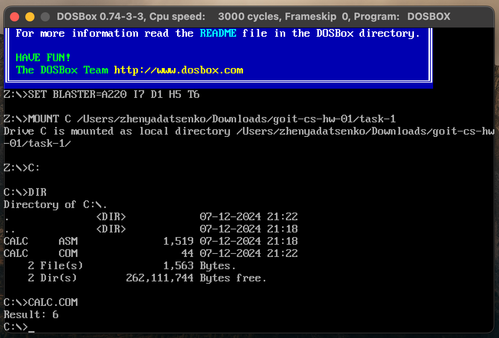
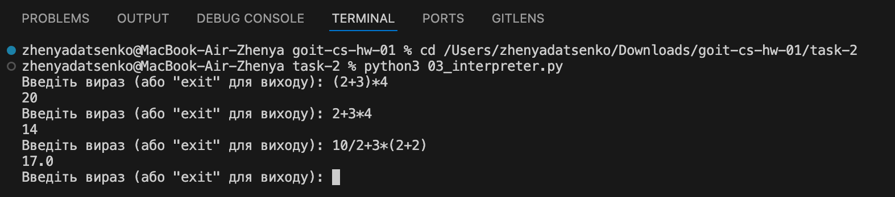

# goit-cs-hw-01

## Мета та тематика

Ці завдання покликані зміцнити розуміння архітектури комп’ютерів, принципів роботи з асемблером та поглибити знання про лексичний і синтаксичний аналіз виразів. Таким чином, ви отримаєте краще уявлення про взаємодію на низькому рівні, а також познайомитеся з концепціями побудови інтерпретаторів для арифметичних операцій.

## Завдання 1

**Опис роботи:**  
На основі прикладу асемблерної програми, що обчислювала `a + b - c`, внесено зміни для обчислення виразу `b - c + a`. Програма зібрана у `.COM`-формат і запущена під DOSBox.

**Результат:**  
Програма успішно виконує задані обчислення та виводить результат.  

## Завдання 2

**Опис роботи:**  
Розширено інтерпретатор арифметичних виразів на Python. Спочатку інтерпретатор підтримував тільки операції `+` і `-`.  
Тепер додано підтримку множення (`*`), ділення (`/`), а також виразів у дужках, що забезпечує правильний порядок обчислень згідно математичних правил.

**Результат:**  
Інтерпретатор коректно обчислює вирази з різними пріоритетами операцій.  

